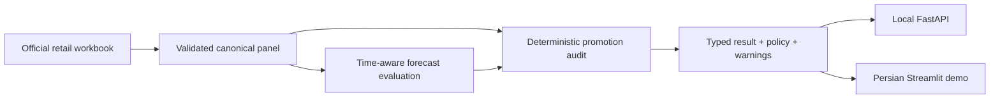
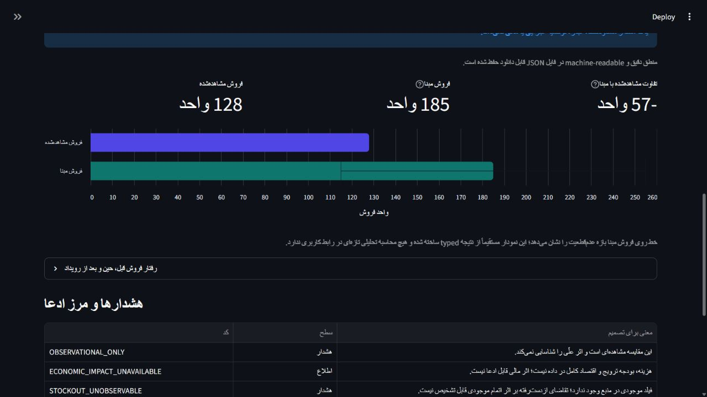

# PromoGuard Retail Intelligence

Evidence-aware retail promotion auditing: real-data validation, time-aware forecast comparison,
observational diagnostics, FastAPI contracts, and a Persian Streamlit review flow.

> Did sales during a promotion differ from a transparent forecast baseline enough to justify a
> controlled test—or should the system abstain?

PromoGuard does **not** claim causal lift, promotion profit, Iranian customer impact, or production
readiness from public observational data.

## What works today

- ingests and validates the official dunnhumby Breakfast at the Frat workbook;
- creates a canonical weekly store/SKU panel with provenance and quality evidence;
- compares seasonal-naive and recursive-naive forecasts across six expanding time folds;
- discloses paired model coverage and every excluded-row reason;
- audits one promotion using pre/during/post windows, uncertainty, forward-buy, and a versioned policy;
- screens complete, non-concurrently-promoted same-store category neighbors for descriptive
  cross-SKU substitution candidates; it never labels the result causal;
- streams and validates the public Criteo randomized-advertising benchmark, reporting aggregate
  intention-to-treat effects with balance diagnostics while keeping it separate from retail;
- serves typed local FastAPI endpoints and a Persian Streamlit dashboard;
- preserves an explicit abstention result when the evidence is insufficient.

Deeper substitution validation, constrained optimization, monitoring, and an optional
evidence-grounded LLM explanation layer are listed in [ROADMAP.md](ROADMAP.md); they are not current
capabilities. The Criteo benchmark is documented in [docs/causal-benchmark.md](docs/causal-benchmark.md).

## Evidence snapshot

| Evidence | Current real-data result | Meaning |
|---|---:|---|
| Paired forecast rows | 41,516 / 58,131 (71.42%) | both baselines had valid predictions |
| Seasonal-naive WAPE | 0.4005 | weaker than the simple reference on paired rows |
| Recursive-naive WAPE | 0.3483 | retained as the transparent short-horizon baseline |
| Representative audit | -57 units, interval [-127, 13] | observed minus baseline; not causal lift |
| Audit recommendation | `needs_more_evidence` | blocking forward-buy warning; do not roll out |
| Cross-SKU screen | 1 eligible neighbor, 0 candidates | no observed decline crossed the policy threshold; not no-effect proof |
| Criteo randomized ITT benchmark | visit +1.034pp; conversion +0.115pp | external advertising RCT; not a retail causal claim |

Release Gate 5.1 passed 67 tests; the current Demo Mode release passes **73 tests**. Phase 7.1 adds
four checked cross-SKU/presentation cases; the current development suite passes **83 tests**. Command evidence
and the one known dependency deprecation warning are recorded in the
[correctness report](reports/foundation-correctness/release-quality-report.json) and
[Demo Mode report](reports/phase-05/demo-mode-quality-report.json).

## Architecture



All analytical calculations live under `src/promoguard`. The API and dashboard are adapters that
validate input and render typed domain results.

## Reviewer demo

The repository does not redistribute the source dataset and does not substitute synthetic business
data. After placing and ingesting the official workbook as described below, the local reviewer flow
is three commands:

```powershell
python -m pip install -e ".[dev,dashboard]"
python -m promoguard.cli health
streamlit run apps/dashboard/app.py -- --demo
```

The dedicated Demo Mode uses the real processed panel, hides local path details, and guides the
reviewer through data quality, event selection, and the bounded recommendation.



## Full real-data run

Download **Breakfast at the Frat** from the official dunnhumby Source Files page and extract it
under `data/raw/breakfast-at-the-frat/`. Raw and processed files are intentionally ignored by Git.

```powershell
promoguard ingest --input data/raw/breakfast-at-the-frat --output data/processed/breakfast-at-the-frat
promoguard validate --input data/processed/breakfast-at-the-frat
promoguard forecast-evaluate --input data/processed/breakfast-at-the-frat --output reports/phase-02
promoguard promotion-audit --input data/processed/breakfast-at-the-frat --output reports/phase-03
python -m demo.phase4_smoke
```

The audit can also receive `--store-id`, `--upc`, and `--start-date` together. Optional contribution
sensitivity requires an approved per-unit amount, ISO currency, and assumption source. It cannot
change the screening recommendation and is not promotion profit or gross-margin impact.

## Scientific boundaries

- Time-aware forecast accuracy is predictive evidence, not treatment-effect evidence.
- Observed minus forecast is an observational difference, not a causal counterfactual.
- Same-category neighbor co-movement is a descriptive substitution candidate, not a causal
  cannibalization effect or proof of incremental demand.
- The source has no inventory field, so stockout-censored demand cannot be diagnosed.
- Full promotion economics are unavailable; missing values are never invented.
- Public international data proves reproducible engineering, not Iranian product-market fit.

See [docs/limitations.md](docs/limitations.md),
[docs/evaluation-protocol.md](docs/evaluation-protocol.md), and
[docs/model-card.md](docs/model-card.md) for the full contracts.

## API and tests

Run the local-only API at `http://127.0.0.1:8000/docs`:

```powershell
uvicorn apps.api.main:app --reload --host 127.0.0.1
```

Run the current unit and integration suites:

```powershell
python -m ruff check .
python -m pytest -q
python -m compileall -q src apps demo
```

Filesystem-path endpoints are confined to the repository `data/` root. The API is not designed for
direct Internet exposure. Contracts and examples are in
[docs/api-dashboard.md](docs/api-dashboard.md).

## Submission and learning material

The evidence-linked Park package is under
[submission/park-application-1405](submission/park-application-1405/README.fa.md). Personal fields
and unverified traction remain outside source control until Reza supplies and verifies them.

Persian guides under [learning](learning/) explain each completed section, changed files, commands,
tests, limitations, and interview questions. Internal AI-agent workflows were moved to
[docs/development](docs/development/) so the public landing page stays product-first.

## AI disclosure and license

Development is openly AI-assisted, but deterministic tests, evidence links, decision records, and
human submission ownership are mandatory. Read [AI_USAGE.md](AI_USAGE.md) for the exact boundary.
Source code is licensed under Apache-2.0; the external dataset keeps its own publisher terms and is
not covered by the code license.
