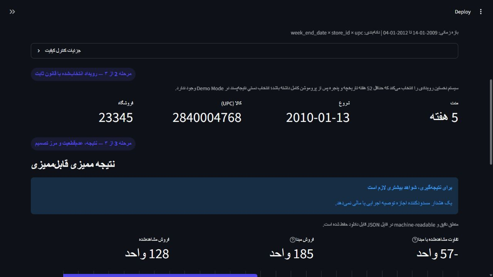

# Screenshot evidence

These screenshots were captured from the local Persian Streamlit dashboard using the processed
public dunnhumby panel. They contain no client or personal data.

`01-quality-report.png` shows the completed data-quality gate: 524,950 rows, 3,909 store-product
series, 149,386 promotion rows, and zero duplicate grain rows.

`02-observational-audit.png` shows the representative event selection and the updated screening
recommendation. The visible message intentionally asks for more evidence; it is not a causal,
rollout, or financial approval.

`03-demo-mode-event-result.png` shows the deterministic representative event, the three core
numbers, and the Persian abstention recommendation. The local path and development controls are
absent from the recorded flow.

`04-demo-mode-chart-warnings.png` shows observed versus baseline sales, the baseline uncertainty
interval, translated warning codes, and the explicit non-causal/non-financial claim boundary. The
numbers are mapped directly from `PromotionAuditResult`.
