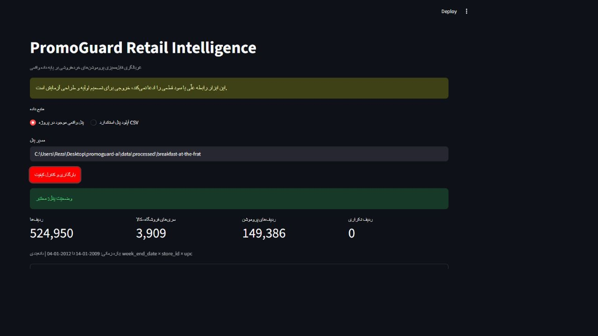
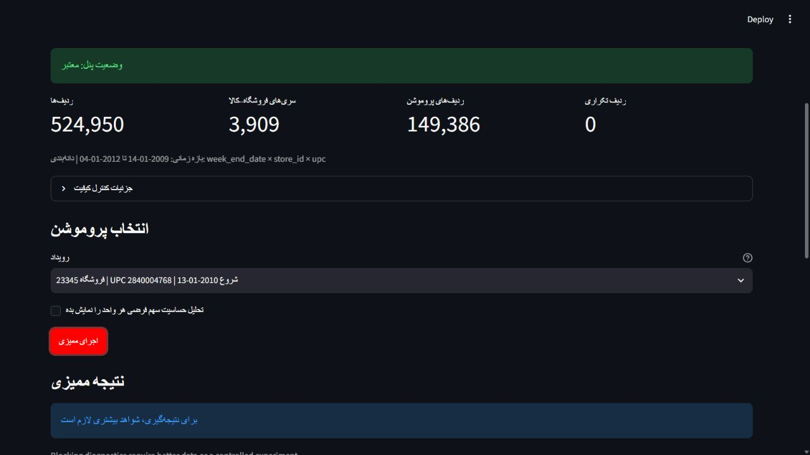

# Screenshot evidence

These screenshots were captured from the local Persian Streamlit dashboard using the processed
public dunnhumby panel. They contain no client or personal data.

`01-quality-report.png` shows the completed data-quality gate: 524,950 rows, 3,909 store-product
series, 149,386 promotion rows, and zero duplicate grain rows.

`02-observational-audit.png` shows the representative event selection and the updated screening
recommendation. The visible message intentionally asks for more evidence; it is not a causal,
rollout, or financial approval.
