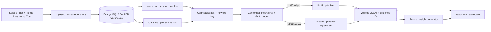

# نقشه راه سه‌جانبه: شغل داده، پارک علم و فناوری دانشگاه تهران و AIIF

تاریخ تحلیل: ۷ شهریور ۱۴۰۵ / ۲۹ اوت ۲۰۲۶

## جمع‌بندی اجرایی

بهترین انتخاب برای شرایط فعلی رضا، مسئله‌ی ۶۵ AIIF است:

> **PromoGuard — سامانه‌ی هوشمند و قابل‌اعتماد سنجش اثر واقعی تخفیف، پروموشن و هم‌خوری محصولات برای FMCG و خرده‌فروشی ایران**

پرسش محصول به زبان ساده:

> «فروش بعد از تخفیف بالا رفت؛ اما واقعاً فروش تازه ساختیم یا فقط خرید آینده را جلو انداختیم، از محصول خودمان دزدیدیم و حاشیه سود را سوزاندیم؟»

این پروژه برای هر سه هدف مناسب است:

1. برای پارک، یک درد صنعتی ایرانی، مدل درآمدی B2B، فناوری قابل دفاع و MVP قابل نمایش دارد.
2. با [RFS شماره ۶۵ AIIF](https://aiif.ai/100rfs/rfs/065) انطباق مستقیم دارد و به مسائل ۴۹، ۵۹، ۶۱ و ۶۲ نیز متصل است.
3. برای استخدام، آمار، استنباط علّی، آزمایش A/B، سری زمانی، SQL و انبار داده، Python، بهینه‌سازی، پایش مدل و LLM دارای گاردریل را در یک محصول واقعی جمع می‌کند.

این انتخاب تضمین استخدام یا پذیرش پارک نیست. با توجه به نداشتن سابقه‌ی کار، هدف واقع‌بینانه‌ی شغلی در کوتاه‌مدت «Junior/Applied Data Scientist، Data Analyst/Scientist، ML/AI Intern، Junior ML Engineer یا Analytics Engineer» است؛ آگهی‌های Senior باید به‌عنوان نقشه‌ی مهارت استفاده شوند، نه عنوانی که همین امروز ادعا شود.

## ضرب‌الاجل واقعی

مهلت فراخوان «نوآفرین صنعت‌ساز» از ۳۱ مرداد تا **۱۳ شهریور ۱۴۰۵، برابر با جمعه ۴ سپتامبر ۲۰۲۶** است. مدارک اعلام‌شده شامل کاربرگ ایده، کارت ملی اعضای تیم، گواهی اشتغال به تحصیل دانشجویان و مستندات ایده است؛ پرونده‌ی ناقص یا خارج از بازه بررسی نمی‌شود. صفحه‌ی رسمی: [فراخوان نوآفرین صنعت‌ساز](https://utstpark.ir/industry-innovators/).

این فراخوان مسیر ورود به یک برنامه‌ی شناسایی و حمایت از هسته‌های نوآور است؛ متن فراخوان، پذیرش مستقیم یا استقرار قطعی در پارک را تضمین نمی‌کند.

پیشنهاد عملی: **تا عصر پنج‌شنبه ۱۲ شهریور / ۳ سپتامبر ارسال شود** و روز جمعه فقط حاشیه‌ی اطمینان باشد.

## نتیجه‌ی بررسی ۱۰۶ مسئله‌ی AIIF

صفحه‌ی AIIF برخلاف نام «100RFS»، اکنون **۱۰۶ مسئله** نشان می‌دهد. همه‌ی ۱۰۶ صفحه‌ی مسئله از نظر زمینه، مسئله‌ی محوری، فرصت استارتاپی و تناسب با محدودیت‌های شما بررسی شدند. رتبه‌بندی کامل در فایل جداگانه‌ی `aiif-106-triage-fa.md` آمده است.

معیارهای انتخاب:

- هم‌پوشانی با آگهی‌های شغلی داده و AI؛
- قابلیت ساخت توسط یک نفر؛
- دسترسی به داده و امکان ارزیابی صادقانه؛
- ظرفیت تبدیل شدن به محصول یا پایلوت، نه فقط نوت‌بوک؛
- استفاده از دارایی‌های فعلی GitHub؛
- ریسک مقرراتی، سخت‌افزاری و نیاز به متخصص حوزه؛
- امکان تمایز از پروژه‌های تکراری.

### شش انتخاب قابل دفاع

امتیازها ارزیابی داخلی این گزارش‌اند، نه امتیاز رسمی پارک یا AIIF.

| رتبه | ایده | تناسب سه‌جانبه | توضیح ساده | مانع اصلی |
|---:|---|---:|---|---|
| ۱ | **#65 PromoGuard** | ۹۲/۱۰۰ | می‌سنجد تخفیف واقعاً چقدر فروش و سود تازه ساخته است | داده‌ی هزینه و پروموشن و خطر ادعای علّی از داده‌ی مشاهده‌ای |
| ۲ | **#59 DemandShift** | ۸۶/۱۰۰ | تقاضا را با بازه‌ی اطمینان پیش‌بینی و تصمیم خرید/موجودی را پیشنهاد می‌کند | بازار پروژه‌های forecasting شلوغ است و داده‌ی واقعی لازم دارد |
| ۳ | **#49 GrowthLift** | ۸۴/۱۰۰ | می‌گوید به چه مشتری واقعاً باید مشوق داد، نه فقط چه کسی احتمال ریزش دارد | نمونه‌کارهای uplift روی دیتاست‌های تکراری زیاد شده‌اند |
| ۴ | **#71 SalesSignal** | ۸۲/۱۰۰ | از تماس و جلسه‌ی فروش، ریسک و فرصت قابل اقدام استخراج می‌کند | تمایز آماری کمتر و بازار meeting intelligence شلوغ‌تر است |
| ۵ | **#24 Hotel Revenue Copilot** | ۷۹/۱۰۰ | برای هتل/اقامتگاه، قیمت و ظرفیت را با توجه به تقاضا پیشنهاد می‌کند | دسترسی به داده‌ی رزرو و قیمت رقبا |
| ۶ | **#99 Bearing Sentinel** | ۷۶/۱۰۰ | خرابی تجهیز دوار را زود تشخیص می‌دهد و زمان بازرسی را پیشنهاد می‌کند | سنسور، سخت‌افزار و شریک صنعتی؛ برای MVP واقعی دشوارتر است |

### چه زمانی گزینه‌ی دیگری بهتر است؟

- اگر هدف فوری فقط نشان دادن توان ساخت به AIIF باشد، #71 سریع‌ترین گزینه است چون AURALIS بخش بزرگی از زیرساخت آن را دارد.
- اگر هدف اصلی پژوهش عمیق و پارک باشد و شریک صنعتی پیدا شود، #99/#66 از پروژه‌ی bearing فعلی استفاده‌ی مستقیم می‌کند.
- اگر هدف اصلی مصاحبه‌ی Data Scientist با تمرکز causal marketing باشد، #49 گزینه‌ی تمیزتری است، ولی به‌تنهایی تمایز کمتری از #65 دارد.
- اگر به داده‌ی فروشگاهی/پروموشن دسترسی پیدا نشود اما به داده‌ی هتل یا رزرو دسترسی واقعی باشد، #24 می‌تواند جایگزین شود.

## چرا PromoGuard با وجود رقبای بزرگ هنوز انتخاب خوبی است؟

این ایده در سطح جهانی بکر نیست. PepsiCo در مقاله‌ی ۲۰۲۶ خود، PromoAI را به‌صورت «پیش‌بینی تقاضای پروموشن + بهینه‌سازی ریاضی تحت محدودیت‌های کسب‌وکار» توصیف کرده است. محصولات تجاری مانند TrueGradient و SymphonyAI نیز lift، cannibalization و margin impact را هدف گرفته‌اند. منابع: [مقاله‌ی PepsiCo](https://arxiv.org/abs/2606.17941)، [نمونه‌ی محصول تجاری](https://www.truegradient.ai/solutions/trade-promotion-optimization).

بنابراین نباید ادعا کرد «اولین سیستم دنیا» یا «بدون رقیب» است. فضای قابل دفاع شما این است:

- مشتری اولیه: پخش‌کننده، خرده‌فروش یا برند ایرانی متوسط که هنوز با Excel/POS کار می‌کند؛
- نقطه‌ی ورود: **Post-event Promotion Audit**، نه ساخت کل پلتفرم RGM؛
- داده‌ی ورودی: CSV ساده، بدون پروژه‌ی یکپارچه‌سازی چندماهه؛
- خروجی: سود افزایشی، هم‌خوری، خرید جلوافتاده، عدم‌قطعیت و تصمیم «تأیید/رد/آزمایش بیشتر»؛
- استقرار محلی یا on-premise برای داده‌ی حساس؛
- سازگاری با تورم، جهش قیمت، کمبود موجودی و شکست الگوی تاریخی؛
- مدل به‌جای اعتمادبه‌نفس مصنوعی، وقتی شواهد کافی نیست **امتناع** می‌کند.

در جست‌وجوی فارسی، ابزارهای عمومی forecasting، ERP و باشگاه مشتریان دیده شدند، اما نمونه‌ی ایرانیِ مستند و مستقیمی با تمرکز هم‌زمان بر «اثر علّی پروموشن + هم‌خوری + عدم‌قطعیت کالیبره» پیدا نشد. این نبودن در جست‌وجو اثبات نبودن رقیب نیست؛ باید با حداقل ۵ مصاحبه‌ی صنعتی و جست‌وجوی میدانی اعتبارسنجی شود.

## معماری پیشنهادی



قاعده‌ی اصلی معماری: **LLM هیچ محاسبه‌ای انجام نمی‌دهد.** مدل‌های آماری و SQL اعداد را می‌سازند؛ LLM فقط یک شیء JSON کنترل‌شده را به توضیح فارسی تبدیل می‌کند و هر عدد باید شناسه‌ی شواهد داشته باشد.

### لایه‌ی داده

جدول‌های اصلی:

- `fact_sales_daily`: تاریخ، فروشگاه/کانال، SKU، تعداد، درآمد، مرجوعی؛
- `fact_promotions`: نوع تخفیف، عمق تخفیف، شروع/پایان، هزینه، کمپین؛
- `fact_inventory_daily`: موجودی، stockout، تأمین مجدد؛
- `fact_price_cost_daily`: قیمت پایه، قیمت خالص، بهای تمام‌شده، حاشیه؛
- `fact_ad_spend_daily`: هزینه‌ی رسانه در صورت وجود؛
- `dim_product`, `dim_store`, `dim_channel`, `dim_calendar`, `dim_campaign`.

هر رکورد علاوه بر زمان رخداد باید زمان «در دسترس شدن برای مدل» داشته باشد تا leakage رخ ندهد. داده‌ی بعد از اجرای پروموشن نباید در ویژگی‌های تصمیم قبل از پروموشن وارد شود.

پشته‌ی پیشنهادی:

- PostgreSQL برای نسخه‌ی محصول و DuckDB برای دمو/تست سریع؛
- dbt برای transformation و نمایش مهارت SQL؛
- Pandera یا قراردادهای Pydantic برای کنترل schema؛
- Airflow پس از آماده شدن vertical slice؛ در هفته‌ی اول یک job ساده کافی است؛
- MLflow برای ثبت آزمایش و artifact؛
- Docker Compose و GitHub Actions برای بازتولید.

### لایه‌ی آماری و ML

نسخه‌ی اول باید از مدل ساده شروع کند:

1. baseline فصلی ساده و سپس LightGBM/CatBoost برای فروش بدون پروموشن؛
2. rolling-origin backtest، نه split تصادفی؛
3. Difference-in-Differences یا doubly robust learner فقط با فرض‌های صریح؛
4. تحلیل افت فروش محصولات جایگزین برای هم‌خوری؛
5. بررسی افت پس از کمپین برای forward-buy؛
6. بازه‌ی عدم‌قطعیت و drift/regime-shift check؛
7. بهینه‌ساز OR-Tools برای انتخاب سناریو تحت محدودیت بودجه، حاشیه و موجودی.

سه خروجی تصمیم:

- **Approve:** کران پایین سود افزایشی مثبت است و کنترل‌های داده پاس شده‌اند؛
- **Reject:** حتی کران بالای سود افزایشی منفی است؛
- **Experiment:** بازه صفر را قطع می‌کند یا فرض‌های causal/data quality نقض شده‌اند.

این خروجی سوم، بخش متمایز و علمی پروژه است.

### لایه‌ی LLM و گاردریل

ورودی LLM باید شبیه این قرارداد باشد:

```json
{
  "claim_id": "promo_2026_041",
  "metric": "incremental_gross_margin",
  "estimate": 184000000,
  "lower": 32000000,
  "upper": 287000000,
  "currency": "IRR",
  "decision": "APPROVE",
  "assumptions": ["no_stockout", "overlap_passed"],
  "evidence_ids": ["sql_sha256:...", "model_run:..."]
}
```

تست‌های اجباری:

- تطابق صددرصدی همه‌ی اعداد متن با JSON؛
- نرخ ادعای بدون شواهد صفر در مجموعه‌ی تست؛
- ممنوعیت ادعای causal در صورت شکست overlap/pre-trend؛
- عدم ارسال PII یا داده‌ی خام مشتری به مدل زبانی؛
- تأیید انسانی قبل از اجرای پیشنهاد مالی.

### معیارهای ارزیابی

| لایه | معیار |
|---|---|
| Forecast | MASE/WAPE، bias، rolling backtest، عملکرد در دوره‌های پروموشن |
| Uncertainty | coverage، interval width، selective risk پس از abstention |
| Causal | placebo، pre-trend، overlap، ATE/CATE calibration، PEHE فقط روی synthetic ground truth |
| Business | incremental gross margin، promo ROI، wasted discount، decision regret |
| Cannibalization | سود/فروش منتقل‌شده میان SKUها و افت پس از کمپین |
| LLM | numeric exactness، evidence coverage، unsupported-claim rate |
| Production | data freshness، schema failures، drift، latency، failed jobs |

برای داده‌ی مشاهده‌ای، Qini/AUUC یا feature importance به‌تنهایی اثبات اثر علّی نیستند. Google در FeedX نیز توضیح می‌دهد که spillover و رقابت میان آیتم‌ها می‌تواند اندازه‌ی اثر را متورم کند: [FeedX](https://github.com/google-marketing-solutions/feedx). پژوهش تازه‌ی CanniUplift نیز شکستن فرض عدم‌تداخل میان واحدها را در محیط چندفروشنده بررسی می‌کند: [CanniUplift، ۲۰۲۶](https://arxiv.org/abs/2607.05242).

## داده‌ی MVP

سه سطح داده باید از هم جدا بماند:

1. **Synthetic generator با حقیقت معلوم:** برای آزمون درستی causal، هم‌خوری، forward-buy و regime shift؛
2. **داده‌ی عمومی واقعی:** برای مهندسی داده و backtest، نه ادعای اثر واقعی روی بازار ایران؛
3. **داده‌ی design partner:** تنها مسیر معتبر برای اثبات ارزش تجاری محلی.

پیشنهاد داده:

- [Corporación Favorita / Kaggle Store Sales](https://www.kaggle.com/c/store-sales-time-series-forecasting/data) برای فروش store–family–day و شاخص `onpromotion`؛
- [dunnhumby Source Files](https://www.dunnhumby.com/source-files/) برای تراکنش خانوار، کمپین و کوپن؛
- X5/Lenta فقط برای benchmark بخش uplift و با رعایت مجوز منبع.

تصمیم اجرایی نهایی با این طرح اولیه متفاوت شد: کل دیتاست عمومی Breakfast at the Frat پردازش شد و
هیچ هزینه، موجودی یا حاشیهٔ مصنوعی به‌عنوان شاهد تجاری ساخته نشد. فیلد غایب باید محدودیت باقی
بماند؛ سناریوی اختیاری contribution فقط با فرض ورودیِ صریح کاربر اجرا می‌شود و profit نام ندارد.

## ساختار Repository

```text
promoguard-ai/
├── apps/
│   ├── api/                  # FastAPI
│   └── dashboard/            # Streamlit v0, Next.js v1
├── src/promoguard/
│   ├── data/
│   ├── forecasting/
│   └── insights/
├── orchestration/
├── data_contracts/
├── configs/
├── tests/
│   ├── unit/
│   └── integration/
├── docs/
│   ├── problem-brief.md
│   ├── evaluation-protocol.md
│   ├── model-card.md
│   ├── limitations.md
│   └── decisions/
├── demo/
├── pyproject.toml
└── README.md
```

در MVP، monorepo و مرزبندی ماژول‌ها کافی است؛ microservice، Kafka، Spark و Kubernetes ارزش نمایشی ندارند و ریسک ناتمام ماندن را بالا می‌برند.

## برنامه‌ی شش‌روزه تا ارسال پارک

### ۷ شهریور — شنبه ۲۹ اوت

- عنوان و یک جمله‌ی مسئله را freeze کنید.
- repository خصوصی/عمومی اولیه و `problem-brief.md` بسازید.
- فرم را با وضعیت واقعی پر کنید؛ هنوز چیزی را «MVP ساخته‌شده» ننویسید.
- ۱۵ مشتری بالقوه برای مصاحبه فهرست کنید: فروشگاه زنجیره‌ای کوچک، شرکت پخش، برند غذایی/بهداشتی، فروشگاه آنلاین.

خروجی روز: یک صفحه‌ی مسئله + نقشه‌ی معماری + فهرست مصاحبه‌ها.

### ۸ شهریور — یکشنبه ۳۰ اوت

- ساعت اداری با ۰۲۱۸۸۲۰۰۷۰۰ داخلی ۱۹۲ تماس بگیرید و فرمت/حجم فایل، امکان تیم تک‌نفره و اختیاری بودن MVP را تأیید کنید.
- حداقل ۳ مصاحبه‌ی ۲۰ دقیقه‌ای انجام دهید.
- فقط این سؤال‌ها را بپرسید: آخرین پروموشن چگونه ارزیابی شد؟ چه داده‌ای دارید؟ تصمیم اشتباه چه هزینه‌ای داشت؟ چه خروجی باعث پرداخت می‌شود؟
- schema و معیار موفقیت را با واژگان مشتری اصلاح کنید.

خروجی روز: ۳ یادداشت مصاحبه، بدون نام/اطلاعات محرمانه در repo عمومی.

### ۹ شهریور — دوشنبه ۳۱ اوت

- یک نمونه‌ی کوچک از Favorita یا داده‌ی مصنوعی بسازید.
- data contract و پنج جدول اصلی را پیاده کنید.
- baseline فصلی + backtest زمانی را اجرا کنید.
- تست leakage و data quality اضافه کنید.

خروجی روز: فرمان واحد `make demo-data` یا معادل Windows و یک نمودار baseline.

### ۱۰ شهریور — سه‌شنبه ۱ سپتامبر

- vertical slice بسازید: upload CSV → تحلیل یک پروموشن → خروجی عددی → صفحه‌ی نتیجه.
- یک نمونه‌ی واضح هم‌خوری ایجاد کنید: فروش SKU-A بالا، SKU-B پایین، سود کل تقریباً ثابت/کمتر.
- خروجی سه‌حالته Approve/Reject/Experiment را نشان دهید.

خروجی روز: دمو قابل اجرا، هرچند ساده و محلی.

### ۱۱ شهریور — چهارشنبه ۲ سپتامبر

- بازه‌ی عدم‌قطعیت، assumptions و محدودیت‌ها را اضافه کنید.
- یک ویدیوی ۹۰ ثانیه‌ای ضبط کنید.
- screenshot، diagram، README و برآورد مالی مقدماتی را آماده کنید.
- اگر دمو واقعاً end-to-end کار نکرد، در فرم آن را «نمونه‌ی رابط/اثبات فنی در حال ساخت» بنویسید، نه MVP تکمیل‌شده.

### ۱۲ شهریور — پنج‌شنبه ۳ سپتامبر

- کاربرگ، تصویر کارت ملی و گواهی اشتغال به تحصیل را کامل کنید.
- نام فایل‌ها، خوانایی، لینک ویدیو و دسترسی repository را روی یک دستگاه/حساب دیگر تست کنید.
- تا عصر به `ie.utstp@ut.ac.ir` ارسال کنید و رسید/نسخه‌ی sent را نگه دارید.

### ۱۳ شهریور — جمعه ۴ سپتامبر

- فقط حاشیه‌ی اطمینان برای خرابی لینک یا نقص پرونده؛ برنامه‌ی اصلی روی این روز نباشد.

## برنامه‌ی چهار هفته‌ای AIIF / نسخه‌ی MVP واقعی

### هفته‌ی ۱: داده و baseline

- مصاحبه‌ها را به ۸ تا ۱۰ نفر برسانید؛
- warehouse و data contracts؛
- seasonal naive و LightGBM؛
- rolling backtest و گزارش خطا بر اساس SKU/فروشگاه/دوره‌ی پروموشن.

### هفته‌ی ۲: اثر افزایشی و هم‌خوری

- synthetic DGP با اثر علّی معلوم؛
- DiD و doubly robust baseline؛
- تست overlap، placebo و pre-trend؛
- substitution graph ساده و post-promo dip.

### هفته‌ی ۳: تصمیم و اعتماد

- conformal/quantile intervals؛
- shift detector؛
- سیاست Approve/Reject/Experiment؛
- optimizer تحت محدودیت بودجه، margin و inventory.

### هفته‌ی ۴: محصول و شواهد

- FastAPI، dashboard، MLflow و CI؛
- insight JSON و LLM guardrails؛
- یک case study کامل؛
- پنج usability test و یک design-partner proposal.

فرم AIIF اعلام می‌کند که حضور دوره‌ی چهارهفته‌ای در کارخانه‌ی نوآوری آزادی، ۹ صبح تا ۹ شب، ۷ روز هفته و تمام‌وقت است. فقط اگر واقعاً می‌توانید این تعهد را انجام دهید تأییدش کنید: [فرم درخواست AIIF](https://aiif.ai/100rfs/apply/).

## برنامه‌ی ۸ تا ۱۲ هفته‌ای برای رزومه و استخدام

### هفته‌های ۵–۶

- یک پایلوت محدود با داده‌ی ناشناس یا نمونه‌ی export شده؛
- تحلیل post-event برای یک category؛
- گزارش assumptions، failure cases و داده‌های لازم برای آزمایش بهتر؛
- اضافه کردن Airflow/dbt فقط پس از پایداری جریان اصلی.

### هفته‌های ۷–۸

- drift/coverage dashboard؛
- مدل کارت، runbook و benchmark؛
- دمو آنلاین یا ویدیوی بدون اصطکاک؛
- مقاله‌ی فنی کوتاه فارسی و انگلیسی.

### هفته‌های ۹–۱۲

- جذب design partner دوم؛
- پژوهش «Selective Promotion Decisions under Interference and Regime Shift»؛
- ارسال هدفمند برای نقش‌های Junior/Applied و کارآموزی؛
- هفته‌ای ۵ درخواست با CV تطبیق‌داده‌شده و ۵ پیام شبکه‌سازی، نه ۱۰۰ درخواست عمومی.

از هفته‌ی ۷ می‌توان درخواست شغلی را شروع کرد؛ لازم نیست پروژه کامل و بی‌نقص شود. شرط شروع: README قابل اسکن، دمو، تست، یک نتیجه‌ی عددی صادقانه و توضیح محدودیت‌ها.

## ممیزی GitHub فعلی

پروفایل عمومی: [RezaAshrafii](https://github.com/RezaAshrafii)

### نقاط قوت

- برای دانشجوی ترم ۴ بدون سابقه‌ی رسمی، ترکیب full-stack، پژوهش آماری و سیستم AI بسیار بالاتر از نمونه‌کار معمولی است.
- `calibrated-reliability` قوی‌ترین نشانه‌ی بلوغ پژوهشی شماست: protocol، experiment registry، provenance، تست، type checking و CI دارد و از ادعای SOTA بی‌پشتوانه دوری کرده است.
- `AURALIS` نشان می‌دهد می‌توانید محصول چندلایه، پردازش صوت، RAG، حافظه و action tracking بسازید.
- `bearing-prognostics-voi` صداقت پژوهشی خوبی دارد؛ نتیجه‌ی اشتباه را supersede کرده و مراحل اعتبارسنجی را تفکیک کرده است.
- `professor-aware-exam-coach` در مرزبندی ساده‌ی معماری و structured-output validation تصمیم مهندسی خوبی نشان می‌دهد.

### مشکلاتی که اکنون first impression را ضعیف می‌کنند

1. پروفایل سه هویت پراکنده می‌فرستد: frontend، RAG product و reliability research؛ داستان تجاری واحد ندارد.
2. pinهای فعلی `AURALIS`، `BookShop`، `professor-aware-exam-coach`، `snappfood-sentiment-classifier` و `tabrizi-bakery-frontend` هستند؛ دو repository پژوهشی جدید و قوی در pinها و بخش Selected Work دیده نمی‌شوند.
3. `AURALIS` در root فایل `README.md` ندارد و workflow فعال فعلی نیز در شاخه‌ی پیش‌فرض دیده نمی‌شود، با این حال badge آن در profile README آمده است.
4. گزارش نهایی AURALIS صادقانه Verdict را `NOT READY` و تست مرورگر را `NOT_RUN` ثبت کرده؛ تا رفع این موارد نباید آن را production-ready معرفی کرد.
5. حجم زیاد گزارش‌ها و release-gateها بدون یک README دو دقیقه‌ای، بار شناختی reviewer را بالا می‌برد و ممکن است اثر «خروجی انبوه AI» ایجاد کند، حتی اگر تصمیم‌های اصلی واقعاً مال شما باشند.
6. `bearing-prognostics-voi` روی شاخه‌ای با نام `codex/...` به‌عنوان default branch است و CI/License مشخص ندارد.
7. `BookShop` تقریباً README پیش‌فرض Next.js، backend فایل‌محور و بدون تست/CI دارد؛ pin شدن آن به اعتبار پروژه‌های جدید لطمه می‌زند.
8. `snappfood-sentiment-classifier` یک baseline آموزشی کوچک است؛ نبود تست آماری، provenance برچسب‌ها و pipeline واقعی آن را برای headline رزومه مناسب نمی‌کند.
9. در کل portfolio، نمونه‌ی روشن PostgreSQL/dbt/Airflow، data quality، model monitoring و business decisioning کم است؛ PromoGuard باید همین شکاف را پر کند.
10. صفر star/fork/follower به معنی بد بودن کد نیست، اما نشان می‌دهد discoverability و شواهد استفاده هنوز ساخته نشده است.

### ترتیب پیشنهادی pinها

1. PromoGuard؛
2. calibrated-reliability؛
3. AURALIS، بعد از README و دمو؛
4. professor-aware-exam-coach؛
5. bearing-prognostics-voi، بعد از پایان حداقل فاز کالیبراسیون/VoI؛
6. یک پروژه‌ی محصولی زنده مانند Bakery، فقط برای نشان دادن frontend.

`BookShop` و sentiment classifier از pin خارج شوند؛ حذف repository لازم نیست.

### کارهای GitHub به ترتیب بازده

- یک README ریشه‌ی کوتاه برای AURALIS: مسئله، کاربر، screenshot، دمو، architecture، تست، محدودیت، run؛
- رفع badge/workflow نامعتبر؛
- افزودن پروژه‌های پژوهشی به Selected Work؛
- تبدیل default branch پروژه‌ی bearing به `main` پس از merge و افزودن CI/License؛
- در هر README، بخش «What I decided» و `AI_USAGE.md` برای تفکیک تصمیم شما از کمک ابزار AI؛
- یک dead end واقعی و دلیل کنار گذاشتنش را مستند کنید؛
- هیچ metric مشتری، درآمد یا production claim ساختگی نوشته نشود؛ نتیجه‌ی public/synthetic با همان برچسب معرفی شود.

پژوهش‌های استخدامی/تجربی که مرور شدند نیز روی end-to-end ownership، داده‌ی نامرتب، impact کسب‌وکار و توضیح ساده تأکید دارند؛ در عین حال بعضی hiring managerها اصلاً فرصت باز کردن GitHub را ندارند. بنابراین شواهد باید در ۶۰ ثانیه‌ی اول README، CV و ویدیو دیده شود، نه در پوشه‌ی دهم. نمونه منابع: [LinkedIn 2026 portfolio signal](https://www.linkedin.com/posts/aishwarya-srinivasan_a-lot-of-people-keep-asking-me-what-kind-activity-7420630283013496832-ZtVP)، [بحث hiring managerها در Reddit](https://www.reddit.com/r/datascience/comments/ujmhtt).

## استفاده از پروژه‌های فعلی در اپلای AIIF

برای ثبت اولیه AIIF لازم نیست صبر کنید PromoGuard کامل شود. خود فرم روی شواهد ساخت و حل مسئله بیش از ادعا و مدرک تأکید می‌کند و انتخاب RFS در مرحله‌ی اول را قطعی نمی‌داند.

پیشنهاد پاسخ:

- بزرگ‌ترین پروژه‌ی ۱۲ ماه گذشته: **AURALIS**، پس از آماده کردن README و ویدیوی کوتاه؛
- قوی‌ترین شواهد دقت آماری: **calibrated-reliability**؛
- پروژه‌ی ناتمام و درس مهم: **bearing-prognostics-voi** و اینکه چگونه نتیجه‌ی نامعتبر را کنار گذاشتید و کالیبراسیون را به مرحله‌ی مستقل تبدیل کردید؛
- RFS مطلوب: **#65**؛
- دلیل انتخاب: پیوند آمار، causal inference، forecasting، تصمیم مالی و reliable AI؛
- ساعات و تعهد: فقط عدد واقعی؛
- تمایل به ادامه‌ی استارتاپ: فقط اگر واقعاً قصد دارید بعد از camp ادامه دهید.

## فرضیه‌ی پژوهشی قابل انتشار

نسخه‌ی پژوهشی پروژه نباید ادعا کند الگوریتم تازه‌ای اختراع شده است. سؤال قابل دفاع:

> آیا سیاست «توصیه‌ی انتخابی» که هنگام شکست فرض‌های علّی یا shift از توصیه امتناع می‌کند، نسبت به مدل نقطه‌ای معمول، نرخ تصمیم‌های زیان‌ده پروموشن را کاهش می‌دهد؟

طرح آزمایش:

- مولد synthetic با ground truth برای seasonality، discount depth، stockout، inflation shock، cannibalization و forward-buy؛
- مقایسه‌ی naive lift، DiD، DR learner و یک مدل interference-aware؛
- کالیبراسیون group/time-aware؛
- معیار اصلی decision regret و harmful-approval rate، نه فقط RMSE یا Qini؛
- اعتبارسنجی خارجی روی Favorita و سپس داده‌ی پایلوت؛
- novelty review پیش از هر ادعای پژوهشی.

این بخش مستقیماً از تجربه‌ی `calibrated-reliability` استفاده می‌کند و پروژه را از dashboardهای forecasting یا RAG wrapperهای تکراری جدا می‌کند.

## Stage gates؛ چه زمانی ادامه دهیم یا pivot کنیم؟

| زمان | شرط ادامه | اگر پاس نشد |
|---|---|---|
| ۸ شهریور | حداقل ۳ مصاحبه و تأیید وجود درد | دامنه را به یک نوع مشتری محدود کنید؛ اگر هیچ درد واقعی نبود #71 را بررسی کنید |
| ۱۰ شهریور | vertical slice روی یک کمپین | LLM و optimizer را حذف کنید و فقط audit قابل اعتماد را تمام کنید |
| پایان هفته ۲ | baseline بهتر از seasonal naive در backtest | ابتدا کیفیت داده/feature availability را اصلاح کنید؛ مدل پیچیده‌تر نسازید |
| پایان هفته ۳ | uncertainty واقعاً harmful approvals را کم کند | ادعای reliable decisioning را محدود و نتیجه‌ی منفی را منتشر کنید |
| پایان هفته ۴ | یک design partner یا حداقل ۵ کاربر تست | محصول را portfolio/research نگه دارید، نه startup traction |
| هفته ۸ | یک case study قابل دفاع | درخواست‌های شغلی را روی Analytics/Junior DS متمرکز کنید و scope را کوچک نگه دارید |

## تصمیم نهایی پیشنهادی

برای پارک و AIIF، **PromoGuard/#65** انتخاب شود. AURALIS و calibrated-reliability به‌عنوان مدرک توان اجرای قبلی استفاده شوند. پروژه‌ی bearing متوقف نشود، اما تا پایان یک milestone روشن فقط ۲۰٪ زمان هفتگی بگیرد. پروژه‌ی جدید دیگری آغاز نشود.

تقسیم زمان بعد از ارسال:

- ۶۰٪ PromoGuard؛
- ۲۰٪ تکمیل یک milestone در calibrated/bearing؛
- ۲۰٪ مصاحبه، شبکه‌سازی، نوشتن case study و درخواست شغلی.
